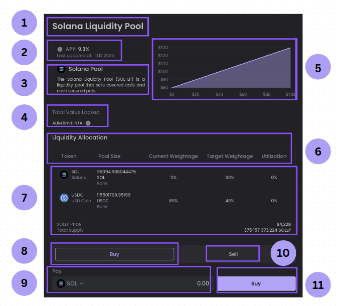

# Pool Overview

The Olive Pool is a liquidity pool that acts as a counterparty to options traders. Traders borrow tokens from the pool to open option positions on the Olive Options exchange.

The Olive pool token derives its value from:

- the assets in the pool
- option premium collected from traders
- generated fees from selling options

## Olive Liquidity Providers

Olive Liquidity Providers play a crucial role in the trading ecosystem by supplying the necessary liquidity for options traders.

Liquidity providers (LPs) ensure there is sufficient liquidity, allowing traders to test their options trading strategies. As a result, Olive connects LPs with traders, allowing the traders to access the liquidity provided by the LPs, and in turn allowing LPs to earn the majority of fees generated from trading activity.

## How to become a Liquidity Provider (LP)

Anyone can become a Liquidity Provider by contributing assets or tokens to the any liquidity pool in the olive finance earn page.

* Liquidity Pool tokens represent your share of the pool.

* You can buy liquidity pools tokens on olive finance by swapping one of the tokens in the liquidity pool for the liquidity pool token. For example If I want to buy the SOL/USDC pool token, I must pay in either SOL or USDC.

* There are fees associated with buying and selling liquidity pools (see target ratio and fees).

## Advantages of the Liquidity Pool System

The Olive Liquidity Pool system offers a user-friendly method for participants to earn passive income while contributing to the liquidity and stability of the trading environment:

* LPs do not need to actively "stake" tokens or "harvest" yields - APR earnings are embedded within each OLP token and accumulate automatically (reflected as an increase in the liquidity pool token price).

* The Liquidity Pool token is also an SPL token, making it easily transferable and tradable like other SPL tokens within the Solana ecosystem.

## Rewards and earnings

* The APY of OLP is calculated based on the premium collected from selling options and the fee associated with selling an option back to the pool. 

* The generated fees are distributed back to liquidity providers by redepositing the fees into the pool hourly.

## Liquidity Pool UI walkthrough

*1. Solana Liquidity Pool: This is the name of the investment pool you are looking at.
2.  APY Info:  Shows the **annual return percentage** you might earn by investing. The date shows when this was last updated.
3. Solana Pool: Explains what this pool does: it makes money by selling **covered calls** and **cash secured puts** (types of crypto options trading strategies).
4. Total Value Locked: Tells how much money is currently in the pool. "AUM" stands for **Assets Under Management**.
5. Graph: Shows a **visual representation** (like price or performance) of the pool over time.
6. Liquidity Allocation Title:  This section explains **how the money in the pool is divided** between different tokens (types of cryptocurrencies).
7. Token Breakdown: 
    
    Shows details for each token in the pool:
    
    - **Token name and symbol (e.g., SOL, USDC)**
    - **Pool size** (how much of that token is in the pool)
    - **Current % weight** of the token in the pool
    - **Target % weight** (goal)
    - **Utilization** (how much is being used)
8. Buy/Sell Buttons: Buttons to either **Buy into** or **Sell out of** the pool.
9. Pay Section: Choose **which token** and **how much** you want to use to invest.
10. Token Price and Supply:
Shows the current **price per pool token** and how many tokens exist in total.
11. Final Buy Button: Click this to **confirm your purchase** and invest in the pool.
